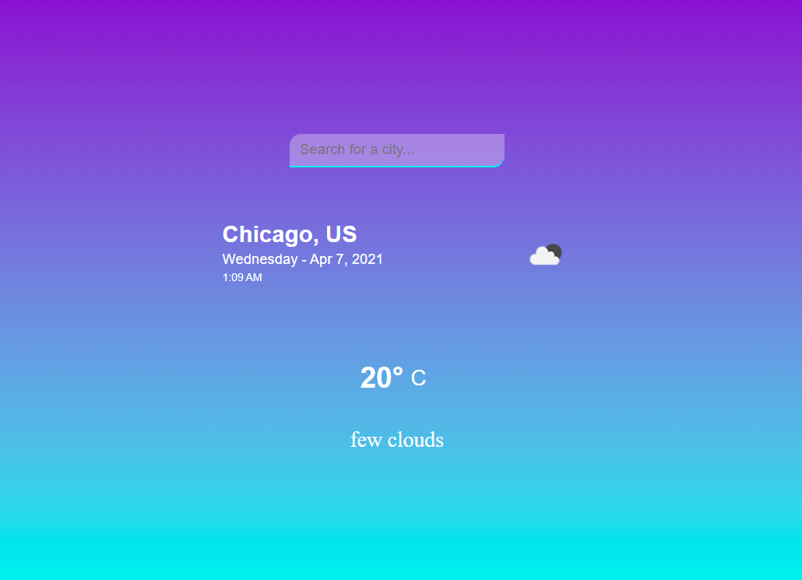
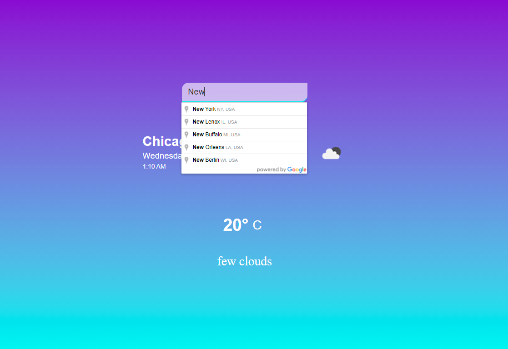
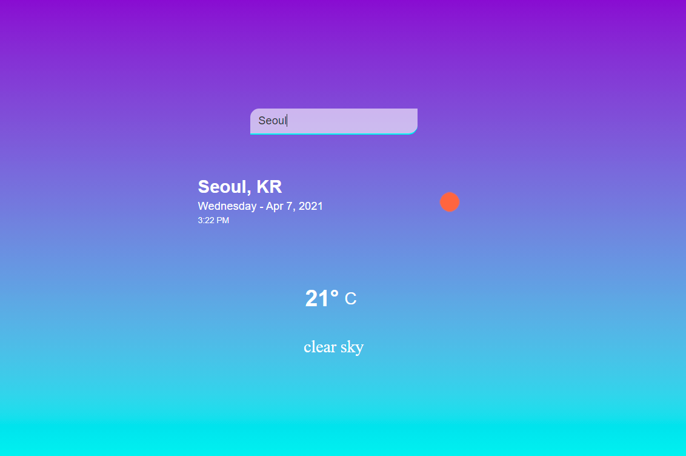

A single page weather application built using HTML, CSS, and Javascript

### Data Source:

[Openweathermap's API](https://openweathermap.org/api)

### Screenshots:

_Homepage_

_Autosuggest_

_Querying a city_

